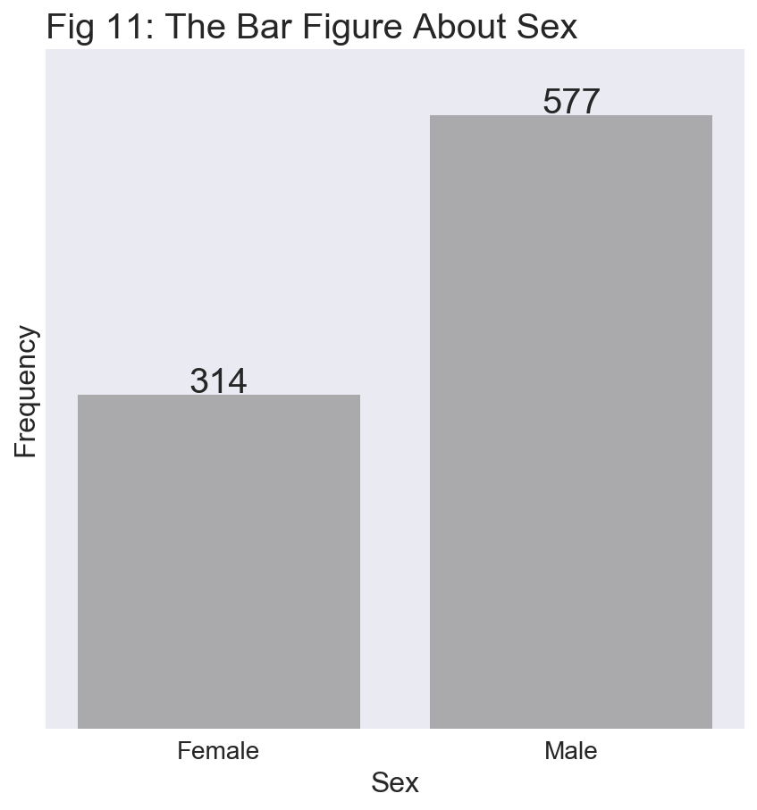

<font size=3>首先导入数据，了解数据基本信息，如列名称及代表意义，数据类型等；另外需要导入需要相关分析的packages，例如pandas、numpy，以及可视化工具matplotlib及seaborn。</font>

<font size=3>数据中列名称包括PassengerId表示乘客编号，Survived表示在事故中是否存活，Pclass表示乘客舱位等级(包括三个等级)，Name表示乘客的姓名，Sex表示乘客的性别，Age表示乘客年龄，SibSp和Parch表示具有相关亲缘关系的乘客数量，Ticket表示购票数量，Fare表示购买的票价、Cabin表示客舱编号、Embarked表示搭乘的港口；从常规情况来看，乘客的**Age(年龄)**、**Pclass(乘客舱位等级)**、**Fare(票价)**、**Sex(性别)**在事故中生还率具有代表性意义，所以本次将从这四个变量对生还情况进行分析。</font>


```python
#import the nessary library
import pandas as pd
import numpy as np
import matplotlib.pyplot as plt
import seaborn as sns
from copy import deepcopy
import math
%matplotlib inline 
%config InlineBackend.figure_format = 'retina'
sns.set(color_codes=True)
```


```python
try:
    df = pd.read_csv("titanic_data.csv")
except:
    df = pd.read_csv("titanic-data.csv")
```


```python
print "The infomation of the value: "
print df.info()
```

    The infomation of the value: 
    <class 'pandas.core.frame.DataFrame'>
    RangeIndex: 891 entries, 0 to 890
    Data columns (total 12 columns):
    PassengerId    891 non-null int64
    Survived       891 non-null int64
    Pclass         891 non-null int64
    Name           891 non-null object
    Sex            891 non-null object
    Age            714 non-null float64
    SibSp          891 non-null int64
    Parch          891 non-null int64
    Ticket         891 non-null object
    Fare           891 non-null float64
    Cabin          204 non-null object
    Embarked       889 non-null object
    dtypes: float64(2), int64(5), object(5)
    memory usage: 83.6+ KB
    None


```python
print "The Columns Name: "
print df.columns
```

    The Columns Name: 
    Index([u'PassengerId', u'Survived', u'Pclass', u'Name', u'Sex', u'Age',
           u'SibSp', u'Parch', u'Ticket', u'Fare', u'Cabin', u'Embarked'],
          dtype='object')


```python
#keep the raw data being unchanged
raw_data = deepcopy(df)

#get the data to analyse
raw_data = raw_data.loc[:, ["Survived", "Pclass", "Sex", "Age", "Fare"]]

raw_data.head()
```


<div>
<style>
    .dataframe thead tr:only-child th {
        text-align: right;
    }

    .dataframe thead th {
        text-align: left;
    }

    .dataframe tbody tr th {
        vertical-align: top;
    }
</style>
<table border="1" class="dataframe">
  <thead>
    <tr style="text-align: right;">
      <th></th>
      <th>Survived</th>
      <th>Pclass</th>
      <th>Sex</th>
      <th>Age</th>
      <th>Fare</th>
    </tr>
  </thead>
  <tbody>
    <tr>
      <th>0</th>
      <td>0</td>
      <td>3</td>
      <td>male</td>
      <td>22.0</td>
      <td>7.2500</td>
    </tr>
    <tr>
      <th>1</th>
      <td>1</td>
      <td>1</td>
      <td>female</td>
      <td>38.0</td>
      <td>71.2833</td>
    </tr>
    <tr>
      <th>2</th>
      <td>1</td>
      <td>3</td>
      <td>female</td>
      <td>26.0</td>
      <td>7.9250</td>
    </tr>
    <tr>
      <th>3</th>
      <td>1</td>
      <td>1</td>
      <td>female</td>
      <td>35.0</td>
      <td>53.1000</td>
    </tr>
    <tr>
      <th>4</th>
      <td>0</td>
      <td>3</td>
      <td>male</td>
      <td>35.0</td>
      <td>8.0500</td>
    </tr>
  </tbody>
</table>
</div>


```python
print "The total number of the passenger: %i" % len(raw_data)
print "The number of the survived passenger in the accident: %i" % sum(raw_data["Survived"] == 1)
print "The ratio of the survived passenger: %.3f" % (sum(raw_data["Survived"] == 1) * 1.0 / len(raw_data))

```

    The total number of the passenger: 891
    The number of the survived passenger in the accident: 342
    The ratio of the survived passenger: 0.384


<font size=3>对数据集加载后，了解数据的缺失情况，Cabin丢失的数据较多(<font color="red">**缺失687个数据**</font>)，Age数据有部分缺失(<font color="red">**缺失177个数据**</font>)。接下来对数据进行分析，为了保持分析处理数据不对原始数据产生影响，防止需要重复使用原始数据时重复加载数据，采用对数据进行完全复制的方式解决。对数据进行初步分析了解总体的**<font color="red">乘客数</font>**和**<font color="green">生还人数</font>**，数据中包含了**<font color="red">891</font>**名乘客，其中生还的人数为<font color="green">342</font>名，生还率**0.384**。</font>

<font size=3><b>从展示的数据类型以及结合分析的方便，Age(年龄)</b>、<b>Pclass(乘客等级)</b>、<b>Fare(票价)</b>以及<b>Sex(性别)</b>的数据类型中，Pclass的数据类型为Int型，但在实际分析中该数据类型最好是Object。其他数据的数据类型可以直接使用，不做处理。接下来将详细地对年龄、乘客等级、票价及性别对生还情况进行。</font>


```python
# cope wtith the data type of Pclass
def passengerclass(data):
    if data == 1:
        return "1st"
    elif data == 2:
        return "2nd"
    elif data == 3:
        return "3rd"
    else:
        return data
raw_data["Pclass"] = raw_data["Pclass"].map(passengerclass)
```


```python
#Fistly analyse the Fare
%pylab inline
plt.boxplot(raw_data["Fare"])
plt.yscale("log")
plt.xlabel("Fare", fontsize=16)
plt.title("Fig 1: Boxplot of Fare", fontsize=20, loc="left", fontweight=1)
line1 = plt.axhline(y=raw_data["Fare"].mean(), color="red", alpha=.5)
line2 = plt.axhline(y=raw_data["Fare"].median(), color="blue", alpha=0.5)
plt.legend([line1, line2], ["Mean value %.3f" % raw_data["Fare"].mean(), 
                            "Median value %.3f" % raw_data["Fare"].median()], loc="upper right")
plt.yticks([])
plt.xticks([])
plt.grid(linewidth=0)
plt.show()
plt.hist(df["Fare"], bins=20)
plt.ylabel("Frequence", fontsize=16)
plt.xlabel("Fare", fontsize=16)
plt.yticks([])
plt.xticks(np.arange(0,max(raw_data["Fare"]), 40))
plt.title("Fig 2: Distribution of Fare", fontsize=20, loc="left")
plt.grid(linewidth=0)
plt.show()

print "The mean value of Fare is {0}.\nThe median value of Fare is {1}." \
        .format(raw_data["Fare"].mean(), raw_data["Fare"].median())
```

    Populating the interactive namespace from numpy and matplotlib


    The mean value of Fare is 32.2042079686.
    The median value of Fare is 14.4542.


<font size=3.5>通过调用pandas的info方法，显示出Fare(票价)数据中没有出现丢失数据，且其数据类型符合数据分析要求。从Fare的盒须图(Fig 1)可知，Fare的平均数(<font color="red">红线显示的平均值为32.20</font>)严重偏离数据群，而Fare的中位数(<font color="blue">绿色直线显示的中位数为14.45</font>)在数据中具有显著的代表性，因此接下来的分析时使用中位数进行分析。从Fare的频数分布图(Fig 2)中，也显示出了购买票价在20左右的人数明显很多，而超过200之后购买的人数偏少；存在的极大值达到500左右影响了平均值的代表作用。综合来看为了保证数据的完整性和数据代表性，暂时使用Fare的中位数分析Fare和乘客生还之间的关系。</font>


```python
#analyse the correlation between the Fare and the Svrvived
def checkstatus(data):
    if(data["Fare"] >= raw_data["Fare"].median() and 
      data["Survived"] == 1) or (data["Fare"] < 
    raw_data["Fare"].median() and data["Survived"] == 0):
        return 1
    else:
        return 0

raw_data["Farestatus"] = raw_data.apply(checkstatus, axis=1)
print "The total of the correlation between the Fare and the Survived is %i" \
        % (raw_data["Farestatus"].sum())
print "The percentage of the correlation between the Fare and the Survived is %.2f " \
        % (raw_data["Farestatus"].sum() * 100.0 /len(raw_data))
```

    The total of the correlation between the Fare and the Survived is 560
    The percentage of the correlation between the Fare and the Survived is 62.85 


```python
#plot the scatter figrue
%pylab inline
plt.figure(1, figsize=(8,6))
plt.subplot(1,2,1)#draw one of the two pic
boxplot1 = plt.boxplot(raw_data[raw_data["Survived"]==0]["Fare"])
plt.title("Fig 3: The Box Figure About Fare And Survived", fontsize=20, loc="left")
plt.ylabel("Fare", fontsize=16)
plt.ylim(0,150)
plt.yticks(np.arange(0,150, 12))
plt.xticks([])
plt.xlabel("Non Survived",fontsize=16)
plt.tick_params(axis="y", labelleft=False)
hline1 = plt.axhline(df.groupby("Survived")["Fare"].mean()[0], c="red", alpha=.5)
plt.legend([hline1], ["Mean Fare:%.3f" % raw_data.groupby("Survived")["Fare"].mean()[0]], loc="upper center",fontsize=16)
plt.subplot(1,2,2)
boxplot2 = plt.boxplot(raw_data[raw_data["Survived"]==1]["Fare"],labels=["Survived"])
plt.ylim(0,150)
plt.yticks(np.arange(0,150, 12))
plt.xticks([])
plt.xlabel("Survived",fontsize=16)
hline1 = plt.axhline(raw_data.groupby("Survived")["Fare"].mean()[1], c="green", alpha=.5)
plt.legend([hline1], ["Mean Fare:%.3f" % df.groupby("Survived")["Fare"].mean()[1]], loc="upper center", fontsize=16)
plt.show()
```

    Populating the interactive namespace from numpy and matplotlib


```python
fare_group_mean = raw_data.groupby("Survived")["Fare"].mean()
fare_group_var = raw_data.groupby("Survived")["Fare"].var()
fare_group_count = raw_data.groupby("Survived")["Fare"].count()
pool_var = (fare_group_var[0] + fare_group_var[1])/ (sum(fare_group_count)-2)
std_err = math.sqrt(pool_var/fare_group_count[0] + pool_var/fare_group_count[1])
t_statistic = (fare_group_mean[0]-fare_group_mean[1]) / std_err
print "The mean of Fare about Survived is %.3f; the mean of Fare about Non Survived is %.3f" \
        % (fare_group_mean[1], fare_group_mean[0])
print "The pooled variance of Fare about different Survived is %.3f" % pool_var
print "The t statistic value is %.3f" % t_statistic
```

    The mean of Fare about Survived is 48.395; the mean of Fare about Non Survived is 22.118
    The pooled variance of Fare about different Survived is 6.097
    The t statistic value is -154.483


<font size=3>利用Fare的中位数分析其和生还情况的关系，显示出Fare和Survived呈现正相关性的数据个数为<b>560</b>，占整个Fare数据集中的比例为<b>62.85%</b>。利用pandas的goupby方法，将票价分类为生还和死亡的两类分析<ol>
<li>从盒须图(Fig 3票价和生还的盒须图)中，可以看书不论生还与否，平均票价都偏离集中分布的区域，因此两者的票价都是一个左偏态分布</li>
<li>死亡的乘客中票价平均值是22.118，而生还的乘客的中票价的平均值是48.395。</li>
<li>对对生还与否和价格关系感兴趣，因此将数据分为生还和死亡，对票价进行t检验统计分析。此处我们提出Null hypothesis为生还乘客的票价和死亡乘客的票价无差异，即总体中生还的票价u和死亡的票价u是相等的；提出Alternative hypothesis为两者的票价均值不等。同时采用two side way的检验方法，设置检验水平alpha值为0.5。</li>
<li>经计算，死亡的票价和生还的票价的t值为-154.483，该统计值已经远大于临界t值。因此我们拒绝接受Null hypothesis，票价对生还情况具有相关性。</li>
</ol></font><br>
<p>==================================================================================================================</p>
<font size=3>接下来分析舱位等级和存活人员的情况</font>


```python
print "The number of different pansenger class:\n"
pclass_data = raw_data.groupby(["Pclass"], as_index=False)["Survived"].count()
print pclass_data
```

    The number of different pansenger class:
    
      Pclass  Survived
    0    1st       216
    1    2nd       184
    2    3rd       491


```python
%pylab inline
pclass_data.plot(x=np.array(["FirstClass", "SecondClass", "ThirdClass"]), kind="bar", 
                align="center", figsize=(8,8), color="grey")
plt.tick_params(axis="x", labelsize=16, rotation=.5) 
plt.title("Fig 4: The Frequency Of The Different Passenger Class", loc="left", fontsize=18)
plt.ylabel("Frequency", fontsize=16)
plt.yticks([])
plt.tick_params(axis="x", labelsize=16) #change the axis x font size
plt.grid(linewidth=0)
plt.legend([])
for (x, y) in zip(range(3), pclass_data["Survived"].values):
    plt.text(x, y+2, "%d" % y, horizontalalignment="center", size=20)
plt.show()
```

    Populating the interactive namespace from numpy and matplotlib


```python
pclass_survive_data = raw_data.groupby(["Survived","Pclass"])["Survived"].count()
pclass_survive_ratio = pclass_survive_data / len(raw_data)
print "The Ratio of The Different Passenger Class In The Total Passenger: \n"
print pclass_survive_ratio
```

    The Ratio of The Different Passenger Class In The Total Passenger: 
    
    Survived  Pclass
    0         1st       0.089787
              2nd       0.108866
              3rd       0.417508
    1         1st       0.152637
              2nd       0.097643
              3rd       0.133558
    Name: Survived, dtype: float64


```python
%pylab inline
plt.figure(figsize=(8,8))
bar1 = plt.bar(x=np.array(["FirstClass", "SecondClass", "ThirdClass"]), height=pclass_survive_ratio[3:], 
               align="center", color="green", alpha=0.5)
bar2 = plt.bar(x=np.array(["FirstClass", "SecondClass", "ThirdClass"]), height=pclass_survive_ratio[:3], 
               align="center", color="red", alpha=0.3)
plt.legend([bar1, bar2], ["Survived", "Non-Survived"], loc="upper left", fontsize=16)
plt.title("Fig 5: The Survived Ratio In The Total Passenger", loc="left", fontsize=20)
plt.ylabel("Ratio", fontsize=16)
plt.ylim(0, 0.6)
plt.yticks(np.arange(0,0.6,0.04))
plt.tick_params(axis="x", labelsize=16)
plt.tick_params(axis="y", labelright="on", labelleft="off", labelsize=12)
plt.grid(axis="x", linewidth=0)
plt.show()
```

    Populating the interactive namespace from numpy and matplotlib


```python
print "The Ratio of The Different Passenger Class In The Different Passenger Class:\n"
diff_pclass_survive_data = pclass_survive_data / np.hstack((df.groupby(by="Pclass")["Pclass"].count(), \
                                                            df.groupby(by="Pclass")["Pclass"].count()))
print diff_pclass_survive_data
```

    The Ratio of The Different Passenger Class In The Different Passenger Class:
    
    Survived  Pclass
    0         1st       0.370370
              2nd       0.527174
              3rd       0.757637
    1         1st       0.629630
              2nd       0.472826
              3rd       0.242363
    Name: Survived, dtype: float64


```python
%pylab inline
plt.figure(figsize=(9,9))
bar1 = plt.bar(x=np.array(["FirstClass", "SecondClass", "ThirdClass"]), height=diff_pclass_survive_data[:3], 
              bottom=diff_pclass_survive_data[3:], align="center", color="red", alpha=0.3)
bar2 = plt.bar(x=np.array(["FirstClass", "SecondClass", "ThirdClass"]), height=diff_pclass_survive_data[3:],
               align="center", color="green", alpha=0.5)
plt.legend([bar1, bar2], ["Survived", "Non-Survived"], loc="upper left", fontsize=16)
plt.title("Fig 6: The Survived Ratio In The Different Passenger", loc="left", fontsize=20)
plt.ylabel("Ratio", fontsize=16)
plt.ylim(0, 1.2)
plt.yticks(np.arange(0,1.0,0.15))
plt.tick_params(axis="x", labelsize=16)
plt.tick_params(axis="y", labelright="on", labelleft="off", labelsize=12)
plt.grid(axis="x", linewidth=0)
plt.show()
```

    Populating the interactive namespace from numpy and matplotlib


<font size=3>从不同舱位等级的乘客数量和生还情况分析(Fig 4显示来各舱位等级的人员频数分布;Fig 5显示来各舱位等级生还情况，且按照占总乘客人数比例来分析;Fig 6分析的是各舱位等级内，乘客生还比例)显示来看，能分析出以下可能性：
<ol>
<li>三等舱的乘客最多，达到了491人；其次是头等舱的乘客，人数为216人；二等舱的人数最少，为184人。因为三等舱的乘客可能人员密度最大，因此可以预见到三等舱中到死亡率占所有乘客的死亡率是最高的。在Fig 5中反应出了，三等舱的死亡率偏高达到了41.75%，考虑到三等舱的疏散设施不完备以及次生性伤害也可能增加伤亡率。</li>
<li>各舱位乘客的死亡率和生还率环比分析，一等舱和二等舱的生还率最高，分别是62.96%和47.28%。三等舱的死亡率表现明显票高达到了75.76%</li>
<li>从生还率上来看，头等舱的乘客的生还率是最高的，占总体人员的15.26%，其次是三等舱的生还率达到了13.35%(在Fig 5中显示)。但是三等舱的生还率高同样是受到人员基数过大的影响。</li>
</ol>
从实际意义上来看，当意外发生实因为三等舱人员多，可能发生其他人为行伤害形成的死亡也会是死亡率增加。考虑到三等舱的乘客实在下层，如果相应的疏散措施缺乏，那么很有可能被困在船舱中。所以综合客观实际情况以及考虑生存率分析，乘客应当尽量避免在三等舱。
</font><br>
<p>==================================================================================================================</p>
<font size=3>接下来分析乘客年龄和存活人员的情况</font>


```python
age_survived = df.loc[:,["Survived", "Age"]]
age_survived.dropna(axis=0, inplace=True)
print "After dropping the missing value, threre are %d the valide data.And there are %d data." \
        % (len(age_survived), len(df))
```

    After dropping the missing value, threre are 714 the valide data.And there are 891 data.


```python
plt.figure(figsize(8,8))
plt.hist(age_survived["Age"], bins=40, color="grey")
plt.title("Fig 7: The Distribution Of Passengers Age", loc="left", fontsize=20)
plt.ylim(0, 65)
plt.yticks(np.arange(0, 60,10))
plt.xlim(0, 90)
plt.xticks(np.arange(0,100, 25))
plt.xlabel("Age", fontsize=16)
plt.ylabel("Frequency", fontsize=16)
plt.tick_params(axis="both", labelsize=14)
plt.tick_params(axis="y", labelright="on", labelleft="off")
plt.grid(linewidth=0)
plt.show()
```


```python
%pylab inline
fig = sns.FacetGrid(raw_data,aspect=4)
fig.map(sns.kdeplot,"Age",shade=True)
fig.set(xlim=(0,int(age_survived["Age"].max())))
plt.title("Fig 8: KDE Distribution of Passenger Age", fontsize=20, loc="left")
plt.ylim(0, 0.05)
plt.yticks(np.arange(0, 0.05,0.008))
plt.xlabel("Age", fontsize=16)
plt.tick_params(axis="both", labelsize=14)
plt.grid(axis="x", linewidth=0)
plt.grid(axis="y", c="green", linewidth=0.2)
plt.show()
```

    Populating the interactive namespace from numpy and matplotlib


```python
%pylab inline
plt.figure(figsize(8, 8))
boxplot1 = plt.boxplot(age_survived["Age"])
addline1 = plt.axhline(age_survived["Age"].mean(), color="blue")
addline2 = plt.axhline(age_survived["Age"].median(), color="green")
maxline = plt.scatter(np.array([1]), np.array([age_survived["Age"].max()]), s=26, c="SpringGreen")
minline = plt.scatter(np.array([1]), np.array([age_survived["Age"].min()]), s=26, c="red")
plt.legend([addline1, addline2, maxline, minline], ["Mean Age %.3f" % age_survived["Age"].mean(), 
                                  "Median Age %.3f" % age_survived["Age"].median(), 
                                    "Max Age %.3f"%age_survived["Age"].max(),
                                    "Min Age %.3f"%age_survived["Age"].min()],
           fontsize=16, loc="upper left")

plt.title("Fig 8: The Box Plot About Age", loc="left", fontsize=20)
plt.ylim(0, 90)
plt.xlabel("Age", fontsize=16)
plt.xticks([])
plt.yticks([])
plt.show()
```

    Populating the interactive namespace from numpy and matplotlib


```python
%pylab inline
def status(data):
    if data == 1:
        return "Survived"
    else:
        return "Non Survived"

age_survived["Status"] =age_survived["Survived"].apply(status)
fig = sns.FacetGrid(age_survived,hue="Status",aspect=4)
fig.map(sns.kdeplot,"Age",shade=True)
fig.set(xlim=(0,int(age_survived["Age"].max())))
plt.title("Fig 9: Age Distribution in Two Types of Survived", loc="left", fontsize=20)
plt.ylim(0, 0.050)
plt.yticks(np.arange(0, 0.050, 0.006), fontsize=12)
plt.xticks(np.arange(0, int(age_survived["Age"].max()), 5), fontsize=12)
fig.add_legend(title="", fontsize=12)
plt.grid(linewidth=0.2,color="black")
plt.show()
```

    Populating the interactive namespace from numpy and matplotlib


```python
intervel_data = pd.qcut(np.arange(0, 110, 10), 10) #cut the 10 intervel
def age_status(data, intervel_data=intervel_data):
    for i in intervel_data:
        if data in i:
            return i

age_survived["Intervel"] = age_survived["Age"].apply(age_status)
age_survived_intervel = age_survived.groupby(["Survived", "Intervel"])["Survived"].count()
age_intervel = age_survived.groupby("Intervel")["Intervel"].count()
print "There are %i passengers between 30 and 40" % age_intervel.values[3]
print "There are %i survived passengers between 30 and 40. And the survived ritio is %.3f in the age rank!" \
        % (age_survived_intervel[1].values[3], 
        age_survived_intervel[1].values[3] * 1.0 / age_intervel.values[3])
```

    There are 155 passengers between 30 and 40
    There are 69 survived passengers between 30 and 40. And the survived ritio is 0.445 in the age rank!


```python
#plot the scatter figrue
%pylab inline
plt.figure(1, figsize=(8,6))
plt.subplot(1,2,1)#draw one of the two pic
boxplot1 = plt.boxplot(age_survived[age_survived["Survived"]==0]["Age"])
plt.title("Fig 10: The Box Figure About Age And Survived", fontsize=20, loc="left")
plt.ylabel("Age", fontsize=16)
plt.ylim(0,90)
plt.yticks(np.arange(0,90, 12))
plt.xticks([])
plt.xlabel("Non Survived",fontsize=16)
plt.tick_params(axis="y", labelleft=False)
hline1 = plt.axhline(age_survived.groupby("Survived")["Age"].mean()[0], c="red", alpha=.5)
plt.legend([hline1], ["Mean Age:%.3f" % age_survived.groupby("Survived")["Age"].mean()[0]], loc="upper center",fontsize=16)
plt.subplot(1,2,2)
boxplot2 = plt.boxplot(age_survived[age_survived["Survived"]==1]["Age"],labels=["Survived"])
plt.ylim(0,90)
plt.yticks(np.arange(0,90, 12))
plt.xticks([])
plt.xlabel("Survived",fontsize=16)
hline1 = plt.axhline(age_survived.groupby("Survived")["Age"].mean()[1], c="blue", alpha=.5)
plt.legend([hline1], ["Mean Age:%.3f" % df.groupby("Survived")["Age"].mean()[1]], loc="upper center", fontsize=16)
plt.show()
```

    Populating the interactive namespace from numpy and matplotlib


```python
age_group_mean = age_survived.groupby("Survived")["Age"].mean()
age_group_var = age_survived.groupby("Survived")["Age"].var()
age_group_count = age_survived.groupby("Survived")["Age"].count()
pool_var = (age_group_var[0] + age_group_var[1])/ (sum(age_group_count)-2)
std_err = math.sqrt(pool_var/age_group_count[0] + pool_var/age_group_count[1])
t_statistic = (age_group_mean[0]-age_group_mean[1]) / std_err
print "The mean of Age about Survived is %.3f; the mean of Age about Non Survived is %.3f" \
        % (age_group_mean[1], age_group_mean[0])
print "The pooled variance of Age about different Survived is %.3f" % pool_var
print "The t statistic value is %.3f" % t_statistic
print "The statics degree of freedom is %i" % (sum(age_group_count)-2)
```

    The mean of Age about Survived is 28.344; the mean of Age about Non Survived is 30.626
    The pooled variance of Age about different Survived is 0.596
    The t statistic value is 38.798
    The statics degree of freedom is 712


<font size=3>对数据集中的年龄进行分析，从年龄分布图的情况可以得出以下结论<ol>
<li>总体年龄分布图(Fig 7年龄分布直方图以及Fig 8年龄分布的核密度图)中，显示了年龄主要集中在15岁至40岁，另外最大的年龄达到了80岁，而最小的年龄是在0.42岁——即是婴儿</li>
<li>分析年龄和生还情况(Fig 9 年龄和生还情况的核密度图)，显示年龄在20岁到50岁之间的人员死亡率偏高，死亡率最高的是在24岁左右达到0.033左右——关于此点，从用该区域分布的乘客数量也是最多的，可以预见到。</li>
<li>从核密度图中，可以看出各年龄段段人员生还情况，生还和死亡比在0岁至12岁以及30岁至39岁之间是明显较高的，考虑到儿童优先的准则的情况下，这个比例是符合了一般情况。</li>
<li>现在对生还率比例较高的区间感兴趣，对30岁到40岁之间(age包含在(30,40]之间)的乘客进行另外分析。经分析显示在该年龄区间内的乘客人数为155人，其中有69人生还，该区间内的生还比例为0.445。</li>
<li>对不同生还情况和年龄进行分类分析(Fig 10年龄和不同生还情况的盒须图)，生还的平均年龄在28.344，死亡乘客的平均年龄值在30.626，两者相差不是很大。对年龄和生还情况进行统计分析，使用t检验的two side way的方法，alpha的值设为0.05；提出Null hypothesis为死亡乘客的年龄和生还乘客的年龄相同，Alternative hypothesis为两者的年龄不同。</li>
<li>计算得到了t的统计值为38.798，而自由度在712，two side way的P value显著小于0.0001。因此拒绝接受Null hypothesis，乘客年龄和生还情况可能存在相关性。</li>
</ol></font><br>


```python
sex_survive_group = raw_data.groupby(["Survived", "Sex"])["Sex"].count()
sex_survive_ratio = sex_survive_group / len(raw_data)
sex_group = raw_data.groupby("Sex")["Sex"].count()
print "The Ratio of The Different Sex In The Total Passenger: \n"
print  sex_survive_ratio
sex_group
```

    The Ratio of The Different Sex In The Total Passenger: 
    
    Survived  Sex   
    0         female    0.090909
              male      0.525253
    1         female    0.261504
              male      0.122334
    Name: Sex, dtype: float64


    Sex
    female    314
    male      577
    Name: Sex, dtype: int64


```python
%pylab inline
plt.figure(figsize=(7,7))
plt.bar(x=np.array(["Female", "Male"]), height=sex_group, align="center", color="grey", alpha=0.6)
plt.title("Fig 11: The Bar Figure About Sex", loc="left", fontsize=20)
plt.xlabel("Sex", fontsize=16)
plt.ylabel("Frequency", fontsize=16)
plt.xticks(fontsize=14)
plt.ylim(0,640)
plt.yticks(np.arange(0, 620,200))
plt.grid(axis="both", linewidth=0)
plt.tick_params(axis="y", labelleft=False)
for (x, y) in zip(range(2), sex_group.values):
    plt.text(x, y+2, "%d" % y, horizontalalignment="center", size=20)
plt.show()
```

    Populating the interactive namespace from numpy and matplotlib





```python
%pylab inline
plt.figure(figsize=(8,8))
bar1 = plt.bar(x=np.array(["Female", "Male"]), height=sex_survive_ratio[2:], 
               align="center", color="green", alpha=0.5)
bar2 = plt.bar(x=np.array(["Female", "Male"]), height=sex_survive_ratio[:2], 
               align="center", color="red", alpha=0.3)
plt.legend([bar1, bar2], ["Survived", "Non-Survived"], loc="upper left", fontsize=16)
plt.title("Fig 11: The Survived Ratio In The Total Sex", loc="left", fontsize=20)
plt.ylabel("Ratio", fontsize=16)
plt.ylim(0, 0.6)
plt.yticks(np.arange(0,0.6,0.04))
plt.tick_params(axis="x", labelsize=16)
plt.tick_params(axis="y", labelright="on", labelleft="off", labelsize=12)
plt.grid(axis="x", linewidth=0)
plt.show()
```

    Populating the interactive namespace from numpy and matplotlib


```python
diff_sex_survive_data = sex_survive_group / np.hstack((raw_data.groupby(by="Sex")["Sex"].count(), \
                                                       raw_data.groupby(by="Sex")["Sex"].count()))
%pylab inline
plt.figure(figsize=(9,9))
bar1 = plt.bar(x=np.array(["Female", "Male"]), height=diff_sex_survive_data[:2], 
              bottom=diff_sex_survive_data[2:], align="center", color="red", alpha=0.3)
bar2 = plt.bar(x=np.array(["Female", "Male"]), height=diff_sex_survive_data[2:],
               align="center", color="green", alpha=0.5)
plt.legend([bar1, bar2], ["Survived", "Non-Survived"], loc="upper left", fontsize=16)
plt.title("Fig 12: The Survived Ratio In The Different Sex", loc="left", fontsize=20)
plt.ylabel("Ratio", fontsize=16)
plt.ylim(0, 1.2)
plt.yticks(np.arange(0,1.0,0.15))
plt.tick_params(axis="x", labelsize=16)
plt.tick_params(axis="y", labelright="on", labelleft="off", labelsize=12)
plt.grid(axis="x", linewidth=0)
plt.show()
```

    Populating the interactive namespace from numpy and matplotlib


<font size=3>从不同性别和人员生还情况分析(Fig 11显示了不同性别的频数;Fig 11显示来不同性别生还与否占总体乘客的比例;Fig 12分析的是不同性别生还与否占各性别内比例)显示来看，能分析出以下可能性：
<ol>
	<li>乘客中男性乘客占总体上的一般以上，达到了577人，而女性乘客的数量为314人。因为男性乘客的基数较大，同时基于对女士和儿童优先的假设，男性的生还率会明显偏低。</li>
	<li>在Fig 11中，显示了男性乘客的死亡率达到了50%以上，同时生还率在12%左右；另一方面，女性的生还率达到了26%左右，而死亡率占总体人数的9%左右。</li>
	<li>在Fig 12中，不同性别内的生还率中，女性的生还率在75%左右。</li>
</ol>
</font><br>

<h3>结论：</h3>
<font size=3><p>本次分析是针对泰坦尼克号的乘客生还情况分析，总共的样本数量为891个；使用了<b>票价、年龄、舱位等级以及性别</b>四个变量和生还情况进行分析——其中舱位等级和性别是Category Variable，年龄和票价是Numeric Variable。在分析年龄和票价使用了t检验的方法，得到两者和生还情况是Independent的关系，但是和生还情况的具体关系还需要深入分析，也需要大群体去检验(泰坦尼克号的总体乘客数量超过了891人)；同时因为年龄存在缺失值，在分析时使用了抛弃该个体的处理方式，对总体预测的影响还需要深入分析。</p>
<p>从四个变量中，仅能得出一个基本的生还情况侧写——一等舱、高票价、女性及低年龄段(包括青年人)具有更高生还率的可能性。但是在客观情况的复杂性上，是需要需要参考更多的变量和数量集才能作出更精确的推断。</p></font>
