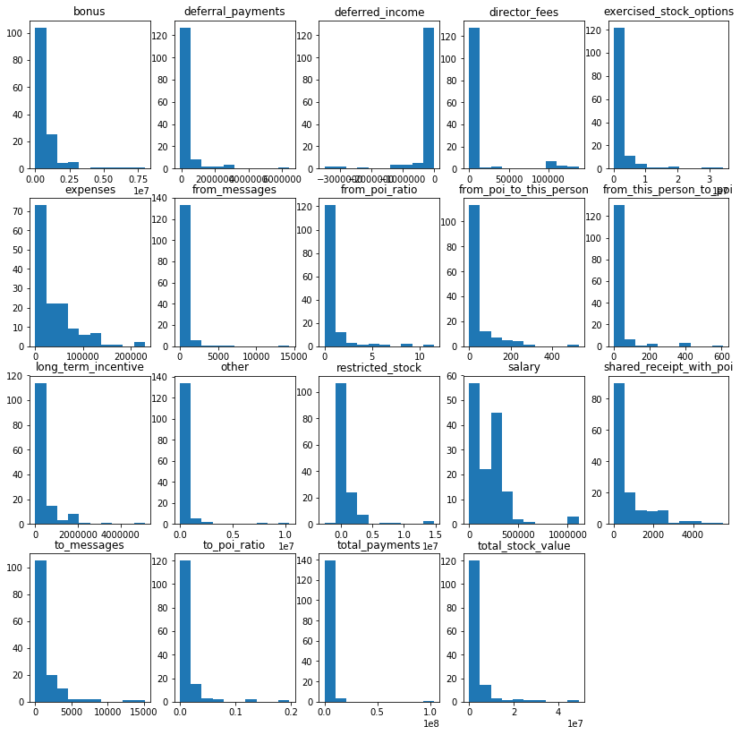

**目录**

[toc]

# 机器学习——安然开放式问题

## 1 项目目标和机器学习应用
安然于 2002 年，由于其存在大量的企业欺诈行为，这个昔日的美国最大的集团土崩瓦解。 在随后联邦进行的调查过程中，大量有代表性的保密信息进入了公众的视线，包括成千上万涉及高管的邮件和详细的财务数据。 **项目目标**运用机器学习的方法，根据安然丑闻中公开的财务和邮件数据来构建相关人士识别符。

## 2 Understanding the Dataset and Question

### 2.1 Data Exploration

经整合后的数据中，包括的**数据点**数量为**146**；已经标识了**POI**人数为**18**人，**未标识POI** 人数为 **128** 人；该数据集中拥有的 **feature** 数量为 **20** 个（ POI 不作为 feature 来统计）。

在数据集中有**缺失值的** **feature** 有 **20** 个，包括的 feature 为：

```
	salary
	to_messages
	deferral_payments
	total_payments
	long_term_incentive
	loan_advances
	bonus
	restricted_stock
	restricted_stock_deferred
	total_stock_value
	shared_receipt_with_poi
	from_poi_to_this_person
	exercised_stock_options
	from_messages
	other
	from_this_person_to_poi
	deferred_income
	expenses
	email_address
	director_fees
```

在数据点中，缺失值最多的 **feature** 是 **loan_advances**，共有 **142** 个人员在该 **feature** 上有缺失值；而在各人员中缺失值最多的是 **LOCKHART EUGENE E**，达到了 **20** 个 feature 有缺失值；此外从名称可以看出 **THE TRAVEL AGENCY IN THE PARK** 是一个组织，而非一个姓名

### 2.2 Outlier Investigation
在迷你项目的数据处理过程中，使用了 matplotlib.pyplot 模块来对 **salary**、**bonus** 两个特征二维数组的可视化分析，分析数据中的安然数据中的异常值。对以上两个特征分析，可知主要的异常值包括 **Total**。

根据对数据的探索，对数据进行如下处理：删除 **loan_advances** 的 feature；删除因缺失值较多的数据点 **LOCKHART EUGENE E** 、删除非人员姓名的对象 **THE TRAVEL AGENCY IN THE PARK**、此外数据中存在一个 **TOTAL** 的数据点，该数据点是所有数据的求和值，不能代表某个人，因此也需要删除 **TOTAL** 数据点。

## 3 Optimize Feature Selection/Engineering
### 3.1 Create new features
从已经完成的 mini project 以及从其他方面了解到到信息，可知在对数据集中是否有欺诈行为的人员判断中，和已知 POI 人员来往的邮件数量是一个重要的 feature。因此根据已有的 from\_messages、from\_poi\_to\_this\_person、to\_message、from\_this\_person\_to\_poi 的特征创建了新的 feature 即收发相关 POI 的信息占总体信息的比例，分别创建了一个 **from\_poi\_ratio** 和 **to\_poi\_ratio** 的 feature

### 3.2 Intelligently select features
从数据集中，存在一个 email\_address 的 feature，在实际应用中可以作为信息的 feature 可能性较低，因此直接删除；利用 SelectKBest 方法进行对所有剩余的 feature 查询 score，经验证新创建的两个 feature 取得了不错的分数分别为： from\_poi\_ratio 得到分数为 5.123946，to\_poi\_ratio 得到分数为 4.094653；另外最高分数为 exercised\_stock\_options，达到了 24.815080；最低分数 restricted\_stock\_deferred，分数为0.065500。最终选择删除最低分数的 feature。 综合以上所做的工作来看，用于机器学习的 feature 共计有 19 个，其中包括的 feature 。此外 选择了一个 poi 作为 label。相关的 feature 及其获得的 score 如下：

```
                               score
	exercised_stock_options    24.815080
	total_stock_value          24.182899
	bonus                      20.792252
	salary                     18.289684
	deferred_income            11.458477
	long_term_incentive         9.922186
	restricted_stock            9.212811
	total_payments              8.772778
	shared_receipt_with_poi     8.589421
	expenses                    6.094173
	from_poi_to_this_person     5.243450
	from_poi_ratio              5.123946
	other                       4.187478
	to_poi_ratio                4.094653
	from_this_person_to_poi     2.382612
	director_fees               2.126328
	to_messages                 1.646341
	deferral_payments           0.224611
	from_messages               0.169701
	restricted_stock_deferred   0.065500
```

### 3.3 Properly scale features
从未进行缩放的 **feature** 展示的直方图中，可以看出大部分 **feature** 的数据分布都呈现出偏斜分布。通过 **numpy** 中的对数函数进行转换，获得到相关的直方图多数转换为正太分布——因为以上 **feature** 都是数值类型的，将其缩放一方面可以加快运行速度也同时避免因为某些 **feature** 的数值过大，导致的表现出权重过高的特点。因此在后续分析中，将暂时保留对数缩放数据，其他缩放方式，将在后续继续分析的过程中进行调试。



## 4 Pick and Tune an Algorithm
### 4.1 Pick an algorithm
初始选择来了多种算法进行测试，其中包括 **LogisticRegression**，**RandomForestClassifier**，**GaussianNB**，**AdaBoostClassifier**，**SVC**，**DecisionTreeClassifier** 等 **6** 种算法进行尝试，并且选用了已经对数方式进行特征缩放的数据集进行分析。

### 4.2 Tune the algorithm
初始分析数据，使用了对数方式对数据进行缩放，除了 **GaussianNB** 算法其他 6 种算法均使用了 **GridSearchCV** 来对参数进行调整。经过以上步骤进行分析，其中有两种算法表现比较良好，分别是：**LogisticRegression** 和 **SVC**，具体结果如下：

```
    The algorithm is LogisticRegression:
    In the algorithm LogisticRegression The best parameters is :
    LogisticRegression(C=1000.0, class_weight='balanced', dual=False,
              fit_intercept=True, intercept_scaling=1, max_iter=100,
              multi_class='ovr', n_jobs=1, penalty='l1', random_state=36,
              solver='liblinear', tol=0.0001, verbose=0, warm_start=False)
              
    The algorithm is SVC:
    In the algorithm SVC The best parameters is :
    SVC(C=10.0, cache_size=200, class_weight='balanced', coef0=0.0,
      decision_function_shape='ovr', degree=3, gamma=0.01, kernel='linear',
      max_iter=-1, probability=False, random_state=36, shrinking=True,
      tol=0.001, verbose=False)   
```                

此外，从 accuracy 的结果来看，我们了解到以上两种算法中使用 SVC 的结果较好，因此选用 SVC 的算法来进行保存我们需要的结果文件。

### 4.3 Discuss parameter tuning and its importance
算法中**参数（ parameters ）**是在进行机器学习过程中传入的某些值（存在某些算法不需要额外传入其他参数，例如 GaussianNB ）。一方面参数影响算法的计算速度，例如：运算性能；另一方面，参数同样会对算法的效果产生重要的影响，例如直接的表现在算法的 accuracy、precious、recall 以及 F1 结果上面。算法中参数调整的重要行就体现在，构建一个良好的模型上不仅需要合适的数据集、选择良好的 features、同时还需要通过参数调整得到不同结果，以此来创建一个合适优异的模型。

在本次项目中，针对选择的 6 种算法，除了 GaussianNB 不需要额外传入参数，在参数筛选过程中使用了 **GridSearchCV** 中使用了默认的 **CV** 参数（默认值为 **3-fold** ）来进行交叉验证，以此选择最佳的算法参数。传入了以下参数传入算法进行调试：

```
{
    "LogisticRegression" : {
        "penalty": ["l1", "l2"],
        "C":[0.1, 1.0, 10., 100., 1000., 10000.],
        "max_iter":[50, 100, 200, 300]
    },
    "SVC": {
        "C": [0.1, 1.0, 10., 100., 1000.],
        "kernel": ["linear", "poly", "rbf", "sigmoid"], 
        "gamma": [0.01, 0.1, 1.0, 10., 100., 1000.]
    },
    "DecisionTreeClassifier":{
        "criterion": ["gini", "entropy"],
        "min_samples_split":[2, 8, 15, 20],
        "min_samples_leaf": [1, 2, 4]
    },
    "RandomForestClassifier": {
        "n_estimators": [2, 5, 10, 50],
        "criterion": ["gini", "entropy"],
        "min_samples_split":[2, 8, 15, 20],
        "min_samples_leaf": [1, 2, 4]
    },
    "AdaBoostClassifier":{
        "n_estimators": [2, 5, 10, 50],
        "learning_rate": [0.2, 0.6, 1.]
    }
}
```

## 5 Validate and Evaluate
### 5.1 Usage of Evaluation Metrics & Algorithm Performance
本次项目中使用 precision 和 recall 来对项目对算法进行评估。precision 指的是被正确检测到的对象（ TP ）占所有实际所有检测对象（ TP + FP ）的比例 ${\frac{TP}{TP\ +\ FP}}$；而 recall 指的是被正确检测到的对象（ TP ）占可被检测到的对象（ TP + FN ）的比例 ${\frac{TP}{TP\ +\ FN}}$。利用 tester.py 模块来评估 LogisticRegression 和 SVC 这两个算法，得到的结果都比较理想，其中 SVC 算法达到的最好的结果，其 precision 达到了 0.42783，recall 值达到了0.57350。

```
    The algorithm is LogisticRegression:
    LogisticRegression(C=1000.0, class_weight='balanced', dual=False,
              fit_intercept=True, intercept_scaling=1, max_iter=100,
              multi_class='ovr', n_jobs=1, penalty='l1', random_state=36,
              solver='liblinear', tol=0.0001, verbose=0, warm_start=False)
        Accuracy: 0.83600   Precision: 0.41756  Recall: 0.58250 F1: 0.48643 F2: 0.53985
        Total predictions: 15000    True positives: 1165    False positives: 1625   False negatives:  835   True negatives: 11375
              
    The algorithm is SVC:
    SVC(C=10.0, cache_size=200, class_weight='balanced', coef0=0.0,
      decision_function_shape='ovr', degree=3, gamma=0.01, kernel='linear',
      max_iter=-1, probability=False, random_state=36, shrinking=True,
      tol=0.001, verbose=False)
        Accuracy: 0.84087   Precision: 0.42783  Recall: 0.57350 F1: 0.49007 F2: 0.53693
        Total predictions: 15000    True positives: 1147    False positives: 1534   False negatives:  853   True negatives: 11466  
```

### 5.2 Discuss validation and its importance & Validation Strategy
机器学习中，使用验证是通过对数据集进行划分训练数据集和测试数据集，以相关数据集不同划分进行训练和测试，以验证算法和数据的拟合和泛化情况。在本次项目中，在 **test.py** 模块中，使用了 **StratifiedShuffleSplit** 的方法进行交叉验证，使用了 **fold** 值为 **1000** 作为 **n_iter** 的参数即迭代次数为 **1000** 次；使用了 **test_size** 默认值 **0.1** 作为测试数据集的百分比，因此经过 **1000** 次迭代后，总共在对大约 **15000** 个数据进行了测试。**StratifiedShuffleSplit** 的交叉验证对象，整合了 **StratifiedKFold** 和 **ShuffleSplit** 两种方法，以此来生成随机 **folds**进行交叉验证，最后生成相关的验证结果。

考虑到结果单独用 **precision** 和 **recall** 容易出现因过度关注该指标而导致另一个指标出现过低的情况，因此可以通过 **F1** 来评估算法的结果。 **F1** 是通过 **precision** 和 **recall** 的调和平均值来计算得到的，其计算方式如下： ${\frac{2}{F1}\ =\ {\frac{1}{precision}\ +\ \frac{1}{recall}}}$。利用 **F1** 来评价已经得到的算法结果，可知 **LogisticRegression** 和 **SVC** 这两个算法得到的结果是比较理想的。


## 6 参考
1. [python 2.7 - 绘图报错](https://stackoverflow.com/questions/28393103/typeerror-cannot-perform-reduce-with-flexible-type)
2. [PANDAS 数据合并与重塑](http://blog.csdn.net/stevenkwong/article/details/52528616)
3. [模型评估与验证 | RyannnG‘s Blog](https://ryannng.github.io/2016/12/12/%E6%9C%BA%E5%99%A8%E5%AD%A6%E4%B9%A0%E6%80%BB%E7%BB%93-%E6%A8%A1%E5%9E%8B%E8%AF%84%E4%BC%B0%E4%B8%8E%E9%AA%8C%E8%AF%81/)
4. [机器学习性能评估指标](http://charleshm.github.io/2016/03/Model-Performance/#fnref:1)
5. [4.3. 数据预处理 — scikit-learn 0.18.1 documentation](http://sklearn.lzjqsdd.com/modules/preprocessing.html)
6. [supernova16/DAND-P5-Machine-Learning: 通过机器学习来识别安然事件中的欺诈嫌疑人](https://github.com/supernova16/DAND-P5-Machine-Learning)
7. [sklearn.model_selection.StratifiedShuffleSplit](http://scikit-learn.org/stable/modules/generated/sklearn.model_selection.StratifiedShuffleSplit.html)
8. [关于StratifiedShuffleSplit的提问](http://discussions.youdaxue.com/t/stratifiedshufflesplit/41200)
